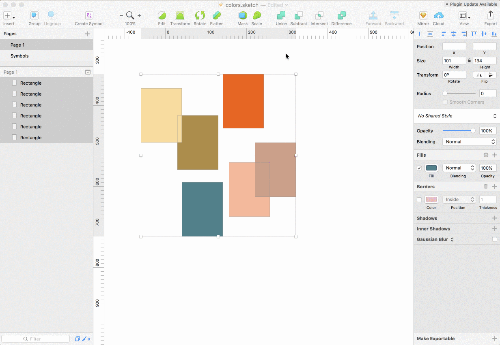

# sketch-plugin-sort-background-colors

Just a simple plugin that sorts layers in a selected artboard (or selected layers) by their background Hue value.

Inspired by a [tweet](https://twitter.com/spjpgrd/status/921459293089656837) by [@spjpgrd](https://twitter.com/spjpgrd) and based his [jsfiddle](http://jsfiddle.net/shanfan/ojgp5718/), so I don't claim any glory for the functionality, I mearly turned it into a plugin 😅

**NOTE:** right now the plugin only supports shapes and assumes all shapes are the same size

## Install

 1. [Download](https://github.com/julianburr/sketch-plugin-sort-background-colors/archive/master.zip) latest version of this repo
 2. Unzip and double click on the **sort-background-colors.sketchplugin** file to install plugin
 3. Done 🎉

 You'll find the plugin under `Plugins > Sort Colors > Sort by Hue`.

 