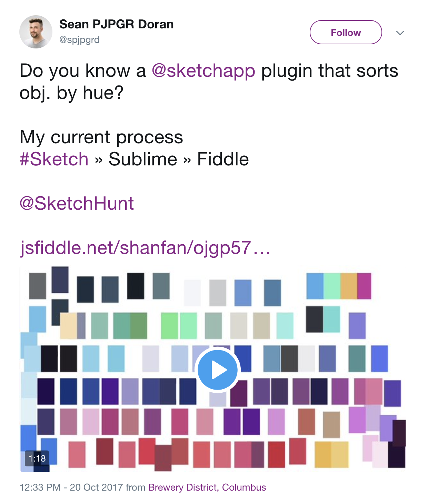

# sketch-plugin-sort-background-colors

Just a simple plugin that sorts layers in a selected artboard (or selected layers) by their background Hue value.

Inspired by the following [tweet](https://twitter.com/spjpgrd/status/921459293089656837) and based on the mentioned [jsfiddle](http://jsfiddle.net/shanfan/ojgp5718/), so I don't claim any glory for the functionality, I mearly turned it into a plugin 😅

**NOTE:** right now the plugin only supports shapes and assumes all shapes are the same size